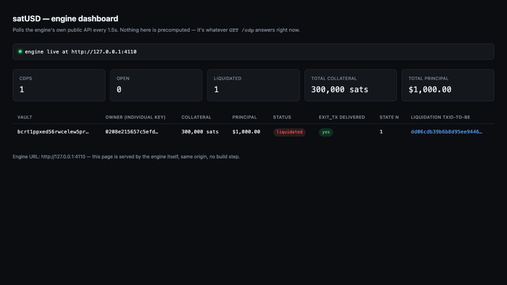
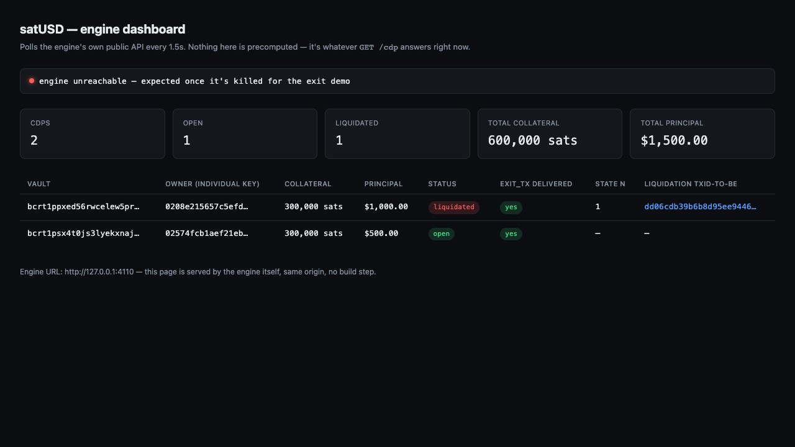
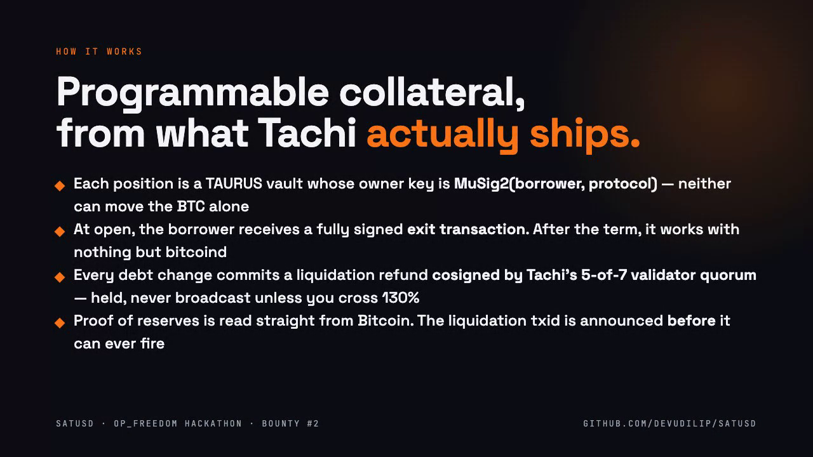
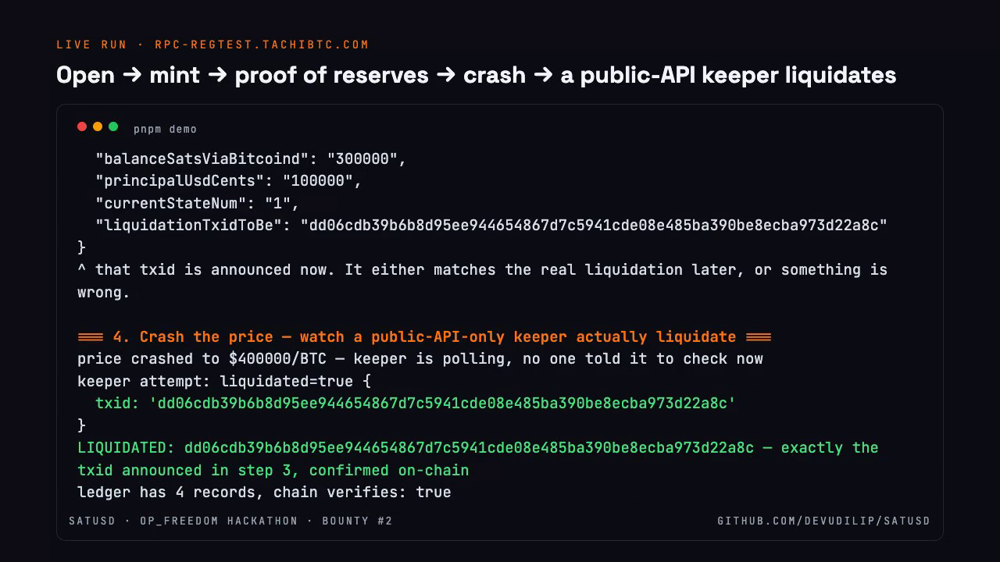
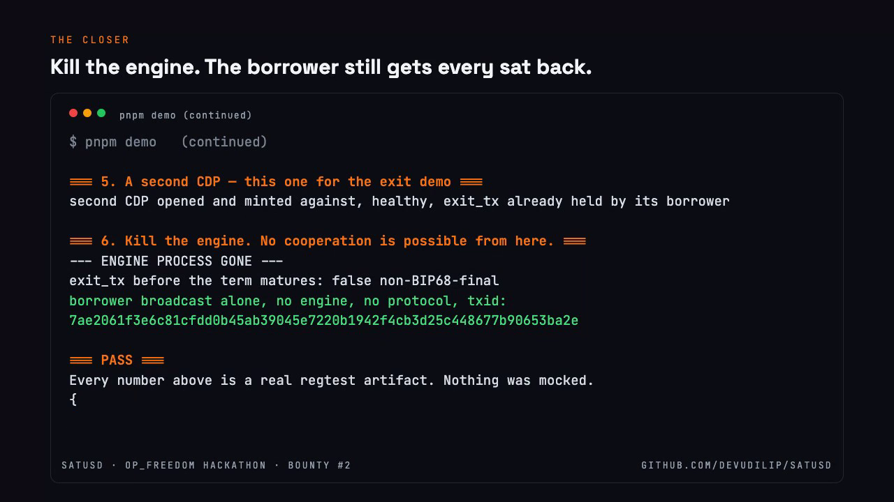
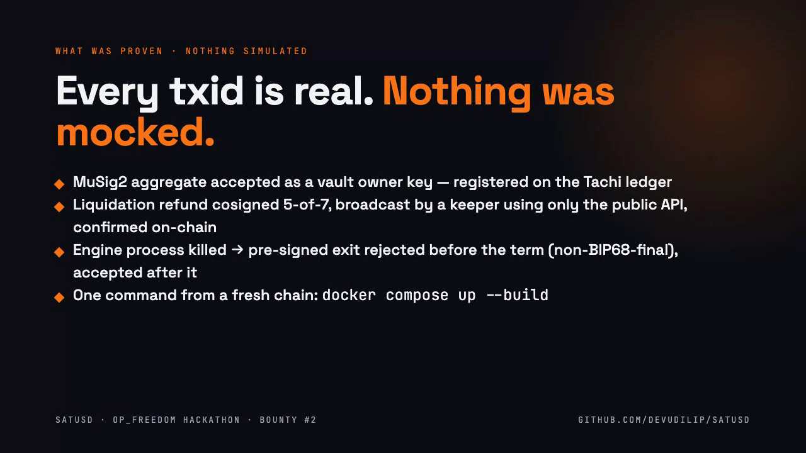

# satUSD — demo

**Video (2:11):** [satusd-demo.mp4](https://github.com/devudilip/satUSD/raw/main/demo/satusd-demo.mp4) — click to play in the browser.

Recorded 2026-10-03 from a live `pnpm demo` run against `rpc-regtest.tachibtc.com` plus a local `bitcoind -regtest`. Every txid shown is real.

## Screenshots

| | |
|---|---|
|  Engine dashboard — first CDP liquidated by a public-API keeper; the liquidation txid matches the one announced at mint |  Second CDP open, engine killed for the exit demo |
|  How it works |  Live transcript: open → mint → proof of reserves → crash → liquidation |
|  The closer: engine gone, borrower broadcasts the pre-signed exit |  What was proven |
